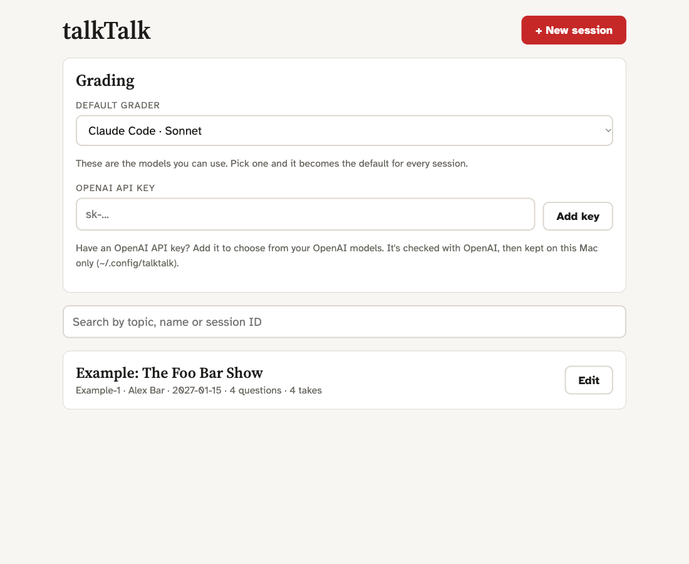
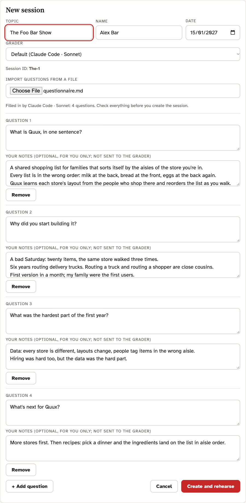
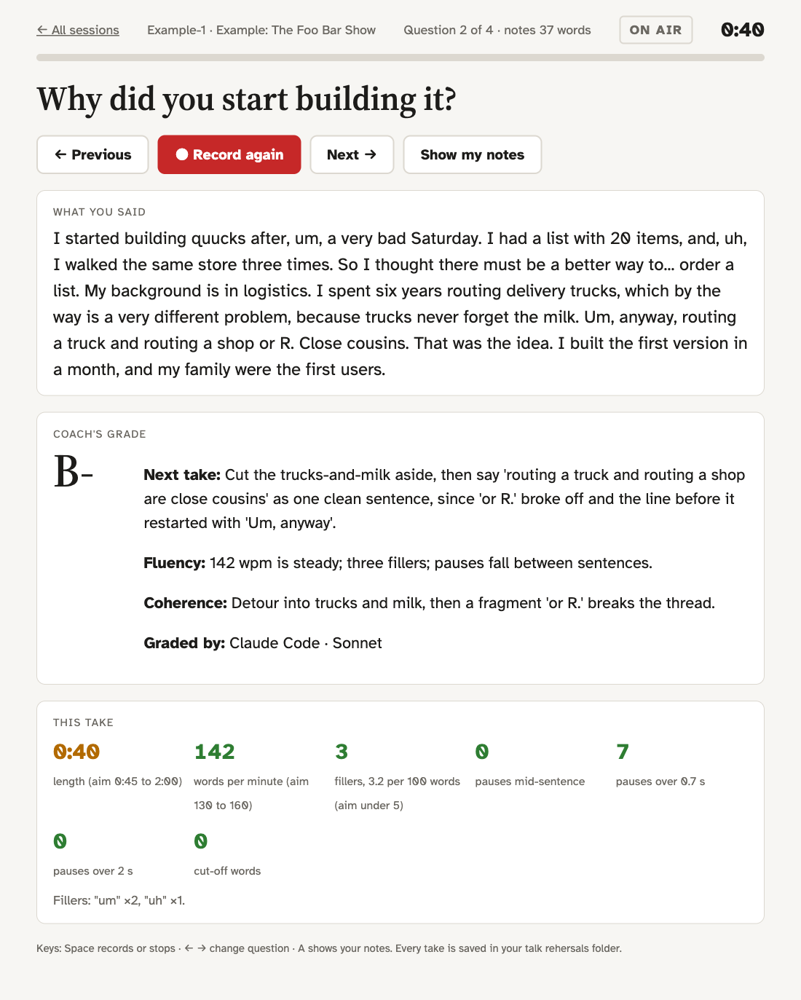

# How to use talkTalk

A walk through one rehearsal, from first start to the next take. For what talkTalk is and why, see the
[README](README.md).

## 1. Start it

Run `./run.sh` in the talkTalk folder, or double-click the desktop app if you built one from
`launcher.applescript`. Chrome opens the dashboard at http://127.0.0.1:8795.

Later you can also double-click `talkTalk.html` in your `talk rehersals` folder on the Desktop. It opens the
dashboard, or tells you how to start talkTalk if it isn't running.

On first run the dashboard also shows `Example-1`, a made-up interview with four graded takes (A, B-, C and D+).
Open it to see what feedback looks like before you record anything. Its questionnaire is `example/questionnaire.md`
in the talkTalk folder, if you want to try the import with it.

## 2. Choose who grades your takes (first time)

The **Grading** box on the dashboard lists every model you can use right now:

- **Claude Code · Sonnet / Opus / Haiku**, if Claude Code is installed and logged in.
- **OpenAI · …**, one entry per chat model your OpenAI API key can use, if you have a key.

No OpenAI key yet but you have one? Paste it into **OpenAI API key** in the same box and click **Add key**. talkTalk
checks it with OpenAI, keeps it on your Mac only (`~/.config/talktalk/openai_key`), and adds that key's models to
the list at once. If `OPENAI_API_KEY` is already set in your shell, talkTalk finds it on its own and the field
doesn't appear.

Pick a model under **Default grader**. That choice is saved and becomes the default for every session. Until you
pick one, talkTalk uses the first model in the list.

Which to pick is up to you. Larger models tend to give sharper notes and take longer; smaller ones are quicker and,
on OpenAI, cost less per take. OpenAI bills each grade to your API account; Claude Code uses your Claude plan.

## 3. Set up an interview

Click **+ New session**. Got the questionnaire as a file? Import it first (see **Questions** below) and most of the
form fills itself. Otherwise fill in:

- **Topic**, **Name** and **Date**. The session ID is made from the topic's first word plus a counter
  (`Product-1`, `Product-2`).
- **Grader**: leave it on **Default (…)** to use the dashboard choice, or pick a model just for this session.
- **Questions**, one per row, each with optional notes for yourself. To skip the typing, click **Import questions from a file** and
  choose a questionnaire (.txt, .md, .docx, .rtf, .odt, .html). Your default grader model reads it (10 to 20
  seconds) and fills in the topic, name, date and questions, including ones that don't end in `?`. Your notes are
  copied from the file word for word. The line under the button says which model filled it in. Check the form and
  fix anything before you continue. Without a model, every line ending in `?` becomes a question.

Click **Create and rehearse**.

## 4. Rehearse

One question fills the screen.

- **Space** starts and stops recording. **← →** move between questions. **A** shows your notes.
- Answer without looking at your notes. Peek after the take, if at all.
- While you talk, Chrome shows a rough live transcript. When you stop, Whisper's transcript replaces it.

## 5. Read the feedback

About 5 seconds after you stop, **This take** shows Whisper's measurements: length, words per minute, fillers (and
which ones), pauses mid-sentence, pauses over 0.7 s and over 2 s, and cut-off words. Tiles outside the targets are
marked.

A few seconds later the grade arrives:

- a letter from A to D,
- **Next take:** the one fix to make on the next take,
- **Fluency:** and **Coherence:**, a short note on each,
- **Graded by:** the model that graded it.

The grade is about how you said what you said. The grader never sees the question or your notes, and never tells
you what you should have said. Takes under 5 words are measured but not graded.

Apply that one fix, record again, repeat. Move on when the grade holds steady.

The [README](README.md#what-to-expect) shows the example's A, B- and D+ takes side by side.

## 6. Change things later

- **A different model for everything:** change **Default grader** in the Grading box. Sessions on Default follow it
  from their next take.
- **A different model for one session:** click **Edit** on its card and change **Grader**.
- **Rename a session, change its date, or edit its questions and notes:** **Edit** on its card. The session ID
  stays the same. Editing a question's text is safe; removing or inserting one shifts which question older takes
  belong to.
- **Find an old interview:** type in the search box on the dashboard (topic, name or ID).

## Where things are

| What | Where |
|---|---|
| Sessions, recordings, transcripts, grades | `~/Desktop/talk rehersals/<session>/` |
| A session's questions and notes | `<session>/session.json` |
| Each take | `<session>/takes/q<n>-<date>-<time>.webm`, `.grade.json` |
| OpenAI key and default grader | `~/.config/talktalk/` |

Nothing in these folders goes to GitHub.
